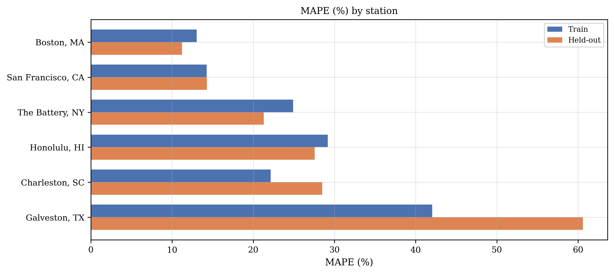
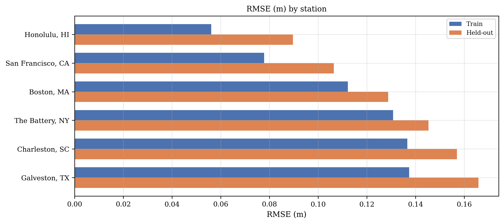
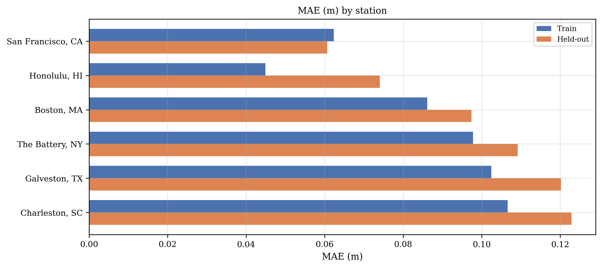
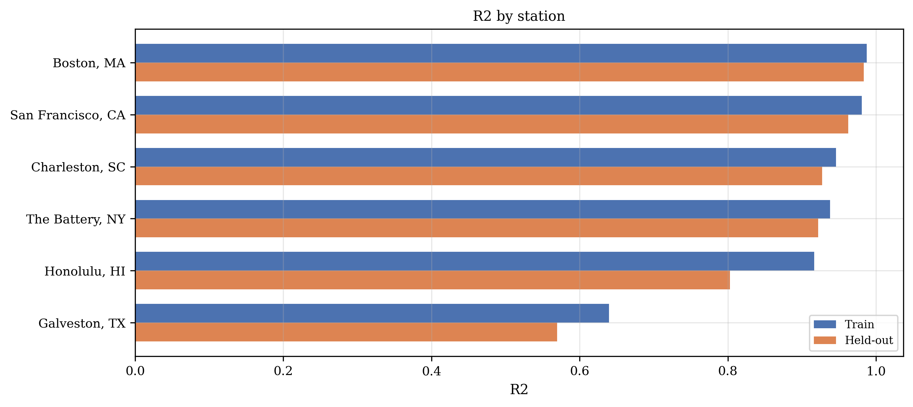
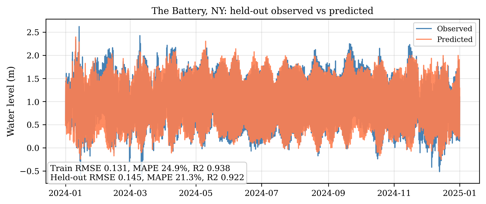
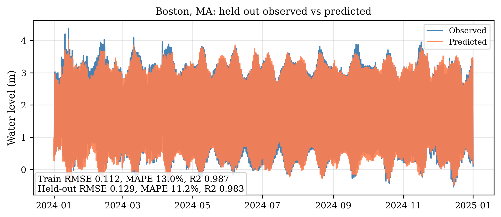
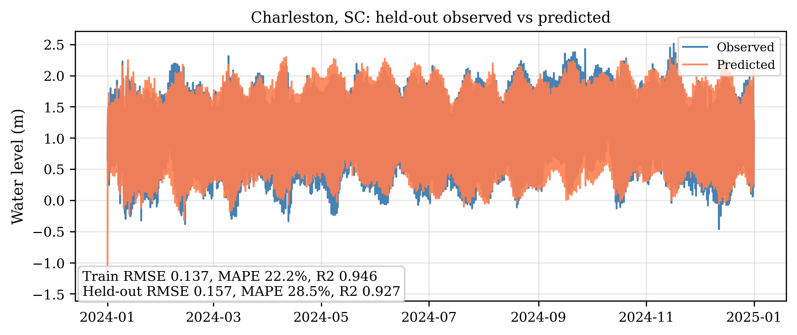
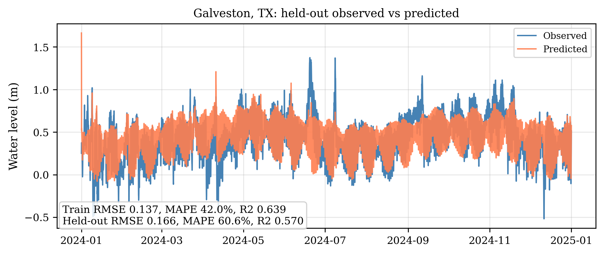
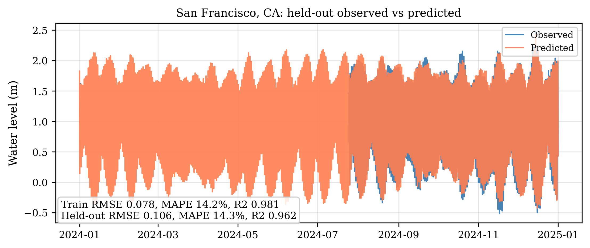
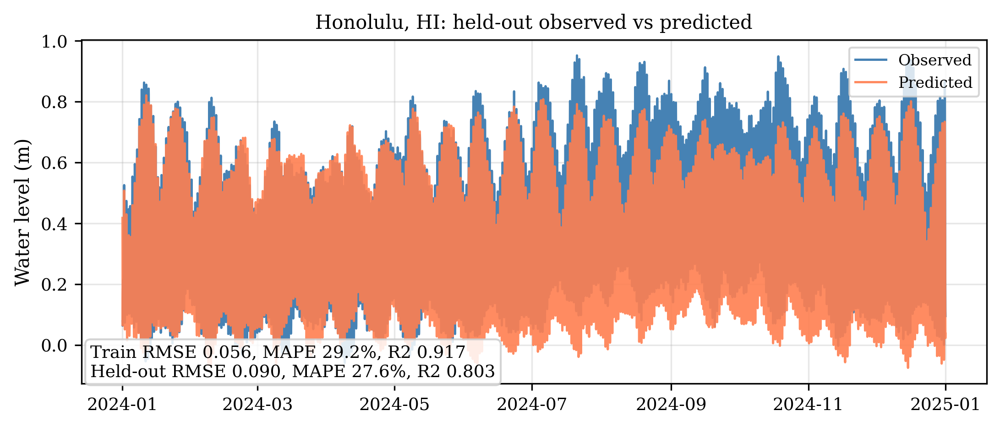

# Tidal Multi-Station Report

## Setup
Fixed model form shared across every station:
- Train window: `2022-01-01` to `2023-12-31`.
- Held-out window: `2024-01-01` to `2024-12-31`.
- Harmonic orders: `M2=4, S2=1, N2=1, K1=2, O1=1, Mf=0, Mm=0, annual=0`.
- Exogenous regressors: `pressure, dp_dt, wind_u` with lag windows `pressure (-2, 0), dp_dt (-2, 0), wind_u (-1, 0)` and Fourier regularization `1.0e-04`.

## Ranked held-out summary
Best held-out MAPE: Boston, MA (MAPE=11.21, RMSE=0.1288, R2=0.9834).
Worst held-out MAPE: Galveston, TX (MAPE=60.6, RMSE=0.1659, R2=0.5695).

| rank | station_name | validation_mape | validation_rmse | validation_r2 |
| --- | --- | --- | --- | --- |
| 1 | Boston, MA | 11.212317862071 | 0.128793742862 | 0.983365463265 |
| 2 | San Francisco, CA | 14.290491299362 | 0.106415424659 | 0.962362166988 |
| 3 | The Battery, NY | 21.28808899313 | 0.145287293591 | 0.921790835076 |
| 4 | Honolulu, HI | 27.559726677856 | 0.089646033493 | 0.802664149331 |
| 5 | Charleston, SC | 28.498241355178 | 0.156967984288 | 0.927081839696 |
| 6 | Galveston, TX | 60.602977015068 | 0.165859221005 | 0.569528465504 |

## Included stations
| station_id | station_name | tidal_regime | region | active_regs | n_train | n_validation | train_rmse | train_mae | train_mape | train_r2 | validation_rmse | validation_mae | validation_mape | validation_r2 | validation_minus_train_rmse | validation_minus_train_mae | validation_minus_train_mape | validation_minus_train_r2 |
| --- | --- | --- | --- | --- | --- | --- | --- | --- | --- | --- | --- | --- | --- | --- | --- | --- | --- | --- |
| 8518750 | The Battery, NY | Semi-diurnal | Northeast Atlantic | pressure,dp_dt,wind_u | 17520 | 8784 | 0.130808218128 | 0.097755118831 | 24.898389028805 | 0.937980216376 | 0.145287293591 | 0.109141817189 | 21.28808899313 | 0.921790835076 | 0.014479075462 | 0.011386698358 | -3.610300035675 | -0.0161893813 |
| 8443970 | Boston, MA | Semi-diurnal | Northeast Atlantic | pressure,dp_dt,wind_u | 17520 | 8784 | 0.112226925095 | 0.086121587009 | 13.031832901879 | 0.987482010571 | 0.128793742862 | 0.097394135068 | 11.212317862071 | 0.983365463265 | 0.016566817766 | 0.01127254806 | -1.819515039808 | -0.004116547306 |
| 8665530 | Charleston, SC | Semi-diurnal | Southeast Atlantic | pressure,dp_dt,wind_u | 17520 | 8784 | 0.136647483367 | 0.106618685736 | 22.152307036832 | 0.945719260889 | 0.156967984288 | 0.1228736913 | 28.498241355178 | 0.927081839696 | 0.020320500922 | 0.016255005564 | 6.345934318346 | -0.018637421192 |
| 8771450 | Galveston, TX | Diurnal/mixed | Gulf of Mexico | pressure,dp_dt,wind_u | 17520 | 8784 | 0.137347932695 | 0.102436012616 | 42.032646911065 | 0.639337562296 | 0.165859221005 | 0.120197710726 | 60.602977015068 | 0.569528465504 | 0.02851128831 | 0.01776169811 | 18.570330104003 | -0.069809096791 |
| 9414290 | San Francisco, CA | Mixed semi-diurnal | Pacific | pressure,dp_dt,wind_u | 17520 | 3864 | 0.077825818002 | 0.062293979326 | 14.248313138302 | 0.980609818467 | 0.106415424659 | 0.060666402325 | 14.290491299362 | 0.962362166988 | 0.028589606657 | -0.001627577001 | 0.04217816106 | -0.01824765148 |
| 1612340 | Honolulu, HI | Mixed | Tropical Pacific | pressure,dp_dt,wind_u | 17520 | 8784 | 0.056077355682 | 0.044881662954 | 29.179122627717 | 0.916630290002 | 0.089646033493 | 0.074055275755 | 27.559726677856 | 0.802664149331 | 0.033568677812 | 0.029173612801 | -1.619395949861 | -0.113966140671 |

## Excluded stations
_None._

## Across-station charts

## Per-station figures

